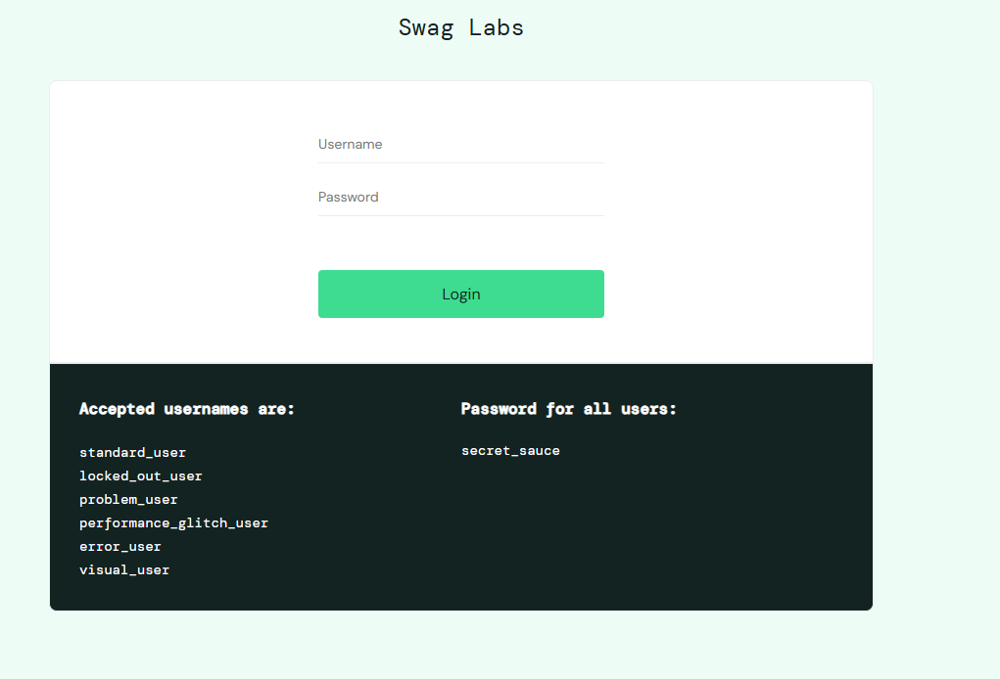

# Projeto de Testes do Sistema SauceDemo

Este repositório documenta o conjunto de testes exploratórios realizados no sistema [SauceDemo](https://www.saucedemo.com/), uma plataforma de demonstração para operações de e-commerce. O objetivo principal deste projeto foi garantir que as funcionalidades de login e navegação funcionassem conforme o esperado, validando a segurança e a usabilidade do sistema em diferentes cenários. Assim, estabeleci uma base confiável para desenvolvedores e QA testarem e validarem as operações do sistema.

## Detalhes do Teste

### Testes Exploratórios de Login

- **Login Simultâneo em Múltiplas Sessões:** Realizei login em diferentes navegadores com a mesma conta para verificar o comportamento do sistema ao manter múltiplas sessões ativas. Validei que o sistema permitiu o acesso sem interrupções e manteve as sessões independentes.
- **Tentativas de Login com Credenciais Incorretas:** Testei o comportamento ao enviar várias tentativas de login com senha incorreta, validando que o sistema exibia avisos apropriados sem bloqueios indevidos.

### Testes Exploratórios de Navegação e Visualização de Produtos

- **Navegação entre Páginas de Produtos:** Explorei as páginas de produtos para garantir que o sistema carregasse as informações corretamente e mantivesse a navegação fluida entre diferentes seções.
- **Adição e Remoção de Produtos no Carrinho:** Testei a funcionalidade de adicionar e remover produtos do carrinho, verificando se as ações atualizavam o conteúdo e o total no carrinho conforme o esperado.

### Exemplo de Casos de Teste

- **Login Bem-Sucedido em Ambientes Múltiplos:** A plataforma permitiu múltiplos logins simultâneos em navegadores distintos.
- **Ordenação de Produtos:** Testei a funcionalidade de ordenação dos produtos por critérios como "maior preço" e "menor preço" para verificar se a lista de produtos era exibida na ordem correta.

## Conclusão

Este projeto de testes do sistema **SauceDemo** destaca a robustez e a usabilidade do sistema para operações de login, navegação e gerenciamento de carrinho. A execução de testes abrangentes assegura que a plataforma ofereça uma experiência de usuário consistente e confiável, alinhada aos padrões de qualidade esperados.
